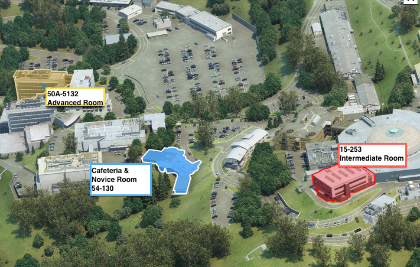

The cafeteria, where we will have lunch, is in Building 54. It is a short walk 
from the Intermediate and Advanced rooms, and is located in the same building as 
the Novice room.

For more details, you can find the cafeteria on this [Interactive Map][map]. 
Click on "Locations" and select the appropriate building, 54. 

[map]: http://map.lbl.gov/#UMAP_2012091840117 "Interactive Map"
