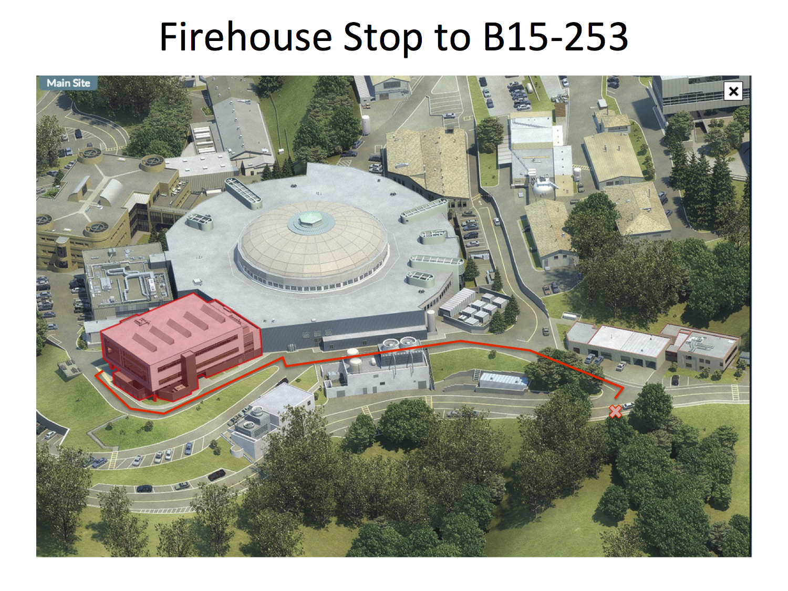

Your track will meet in 15-253 at Lawrence Berkeley National Laboratory. 
To get to the lab, please take the [Blue Uphill shuttle][shuttle] from Berkeley.
To handle overflow, there will also be a special shuttle which is reserved 
just for this bootcamp. If you see one, get on it. Here is the [schedule for the 
special shuttle](shuttle.html).

15-253 stands for building 15, room 253. If you use the shuttle, stop at the 
Firehouse stop. Walk up the hill toward the Guest House. Continue toward 
building 15, which will be on your left. An image of that path is below.

For more details, you can find building 15 on this [Interactive Map][map]. 
Click on "Locations" and select the appropriate building.  

[shuttle]: http://www.lbl.gov/Workplace/Facilities/Support/Busses/off-site_blue.html 
"Uphill Shuttle"
[map]: http://map.lbl.gov/#UMAP_2012091840117 "Interactive Map"
